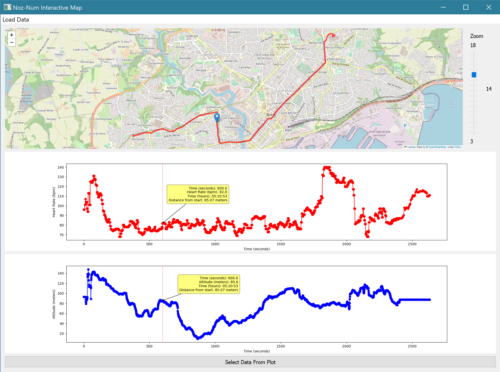

# NozNum_Visualization_Tool
Interactive Visualization Tool for Fit-bit Watch data.  
**Author** : Lucas Brand ([github.com/LVBrand](https://github.com/LVBrand))  
**Organizations** : Université de Bretagne Occidentale ([UBO - Chaire Noz'Breizh](https://nouveau.univ-brest.fr/chaire-noz-breizh/fr)) **;** Centre Européen de Réalité Virtuelle ([CERV](https://cerv.enib.fr))

# Description
This is a simple interactive application that displays a map and plots from data collected from a connected watch (Fit-bit Watch) datafile (.tcx file).

## The project
You can find information about the Noz-Num project on this [website](https://nouveau.univ-brest.fr/chaire-noz-breizh/fr/page/noz-num).

 
# The application
## Pre-requisites
OS : `Windows`  

## The Data
We're using the `.tcx` files from the Fit-bit Charge 5, a smartwatch collecting GPS and physiological data such as heart rate. 

## How to run the application
You just need to download the executable file `NozNumApp.exe` from the Releases section on the right side of the page : [Application Release V.1.0](https://github.com/LVBrand/NozNum_Visualization_Tool/releases/tag/release).  
Here is a quick tutorial on how to use the application after you've downloaded it from :

### 1. Launch the executable file "NozNumApp.exe"
The application will launch in full-screen mod. The minimum size of the window is 1280x720.  

### 2. Load data from a desired .tcx file  
After launching the *NozNumApp.exe* file, the window shown on the image bellow will appear.  
  
To load data, you simply click on the *Load Data* button on the top-left side of the window (Or press `CTRL + o`).
  

### 3. Select the desired file in the dialog window  
Then, a dialog window will appear as shown on the picture bellow and you'll have to select the `.tcx` file from which you want to visualize data. Then, click on *Open* in the dialog window.  
  

### 4. Visualize the data
The picture bellow shows what the window will look like after you've successfully loaded your data.  
  
The first part of the application is dedicated to the Folium Map generated from OpenStreetMap. It creates a route from the GPS data collected from the smartwatch and automatically plots it to a folium map. The application automatically centers the map so we can see the whole route.  
On the right side of the map, you can use the cursor to manage the zoom level of the map. It is, by default, set to *13*.  
Beneath the map, two plots are generated :
- The first curve (red) represents the heart rate (in bpm) as a function of time (seconds).
- The second curve (blue) represents the altitude (meters) as a function of time (seconds).  

You can also click on any dots of the curves and it will quickly reload the map and create a marker on the position corresponding to the data dot you've clicked on.

# Installation 
To be able to run the python program, you'll need to install a few packages. You can use the already existing anaconda environment made during the development of the application which contains all the necessary packages, or you can install them individually.

## 1 . Using the Conda Environment
The conda environment used for developing the program is in the */env* file and it's called `environment.yml`.
You can create an environment on your machine from this environment.yml file in a few steps :

### 1. Create the environment from the `environment.yml` file:  
`conda env create -f environment.yml`  
The name of the environment is written on the firsts line of the yml file. You can freely change it.

### 2. Activate the new environment:  
`conda activate noznum_env`  
In case you have changed the name of the environment in the yml file to `your_env`, you'll have to change `noznum_env` to `your_env`.

### 3. Verify that the new environment was installed correclty:  
`conda env list`  
Or you can also use `conda info --envs`  

## 2 . Install Packages
If you don't want to use the given conda environment, you can install the packages yourself using the `pip` package installer.  
- Pandas : `pip install pandas`
- Folium : `pip install folium`
- PyQt5 : `pip install PyQt5`
- PyQt5 Web Engine : `pip install PyQtWebEngine`
- ElementTree : `pip install elementpath`
- Matplotlib : `pip install matplotlib`

# Create a new executable for the application
If you want to make a new executable from your modified version of the program, you can use `pyinstaller` (How to install : `pip install pyinstaller`).  
To get a single executable file from `main.py`, run this command :  
`pyinstaller --name "custom_app_name" --onefile --noconsole main.py`  
You can give a custom name to your application by changing `"custom_app_name"`. 

# License
MIT License